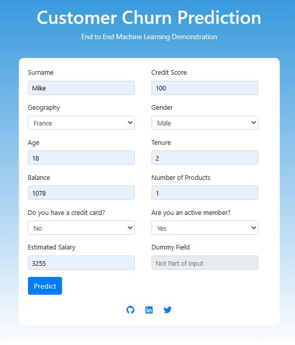
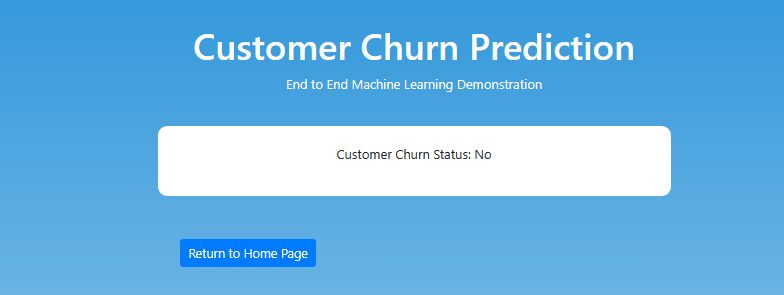

<h1 align="center">Deploying Customer Churn Model to Heroku using Docker and Github Actions</h1>

This repository contains the code and workflows for deploying a machine learning model that predicts customer churn, using Docker for containerization and GitHub Actions for continuous integration and deployment to Heroku

 

 
You can view the deployed application here: <a href="https://customer-churn-551d7373243e.herokuapp.com">https://customer-churn-551d7373243e.herokuapp.com</a>  
Note: This application is hosted on a student account. It will stop working when I exhaust my credits 😑

<h2>Overview</h2>

A few weeks ago, I built an <a href="https://github.com/Oyebamiji-Micheal/End-to-End-Customer-Churn-Prediction-using-MLflow-and-DVC">end to end machine learning project</a> that predicts customer churn using a dataset from <a href="https://www.kaggle.com/datasets/shubhammeshram579/bank-customer-churn-prediction">Kaggle</a>. The project was built using MLflow for model tracking and experiment management, DVC for data versioning, and Flask for serving the model. In this repository, I will be deploying the model to Heroku using Docker for containerization and GitHub Actions for continuous integration and deployment.

<h2>Customer Churn and What it's all about</h2>

Customer churn refers to the phenomenon where customers stop doing business with a company or stop using its products or services. It is a critical metric for businesses, especially in industries with subscription-based models or recurring revenue streams.

Identifying customers who are likely to churn can help businesses take proactive measures to retain them, thereby reducing revenue loss and improving customer satisfaction.

<h2>Dataset</h2>

The dataset used for this project is obtained from <a href="https://www.kaggle.com/datasets/shubhammeshram579/bank-customer-churn-prediction">Kaggle</a>. It contains the following attributes:

- Customer ID: A unique identifier for each customer
- Surname: The customer's surname or last name
- Credit Score: A numerical value representing the customer's credit score
- Geography: The country where the customer resides (France, Spain, or Germany)
- Gender: The customer's gender (Male or Female)
- Age: The customer's age
- Tenure: The number of years the customer has been with the bank
- Balance: The customer's account balance
- NumOfProducts: The number of bank products the customer uses (e.g., savings account, credit card)
- HasCrCard: Whether the customer has a credit card (1 = yes, 0 = no)
- IsActiveMember: Whether the customer is an active member (1 = yes, 0 = no)
- EstimatedSalary: The estimated salary of the customer
- Exited: Whether the customer has churned (1 = yes, 0 = no)

